# Trabajo Práctico N°1 – Manejando el backend

## Alumno
- Nombre: Mauro Ibazeta
- Materia: Taller de Programación 2
- Profesor: Franco Borsani
- Fecha de entrega: 16/09/2025

## Objetivos
Este trabajo práctico tiene como objetivo poner en práctica los contenidos de las primeras 6 clases, entre ellos:
- Manejo de Visual Studio Code (VSC).
- Uso de Git y manejo de ramas (`main` y `test`).
- Manipulación del DOM desde el frontend.
- Uso de Node.js como lenguaje del servidor.
- Implementación de una API REST básica.

## Requerimientos Implementados
La aplicación permite:
- Ingresar conceptos mediante un formulario (nombre y descripción).
- Guardar los conceptos en un arreglo.
- Visualizar los conceptos en una vista HTML con estilos en CSS.
- Procesar solicitudes REST en formato JSON:
  - `GET /conceptos`: obtener todos los conceptos.
  - `GET /conceptos/:id`: obtener un concepto específico.
  - `DELETE /conceptos`: eliminar todos los conceptos.
  - `DELETE /conceptos/:id`: eliminar un concepto específico.

## Instalación y Uso
1. Clonar este repositorio:
   git clone https://github.com/MauroIbazeta/TP1-manejando-backend.git

2. En la consola de GIT entrar al directorio del proyecto y ejecutar el comando npm install (dependencias)

3. Para iniciar el servidor ejecutar en la consola: 
    npm start 

    o para iniciarlo con nodemon ejecutar en la consola: 
    npm run dev

4. Abrir el navegador en http://localhost:3000 (donde se indique servidor ejecutandose)

## Pruebas y validacion
1. Inicio del servidor

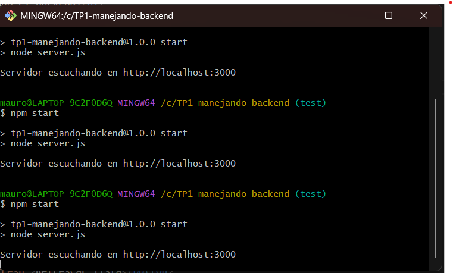

2. Vista principal

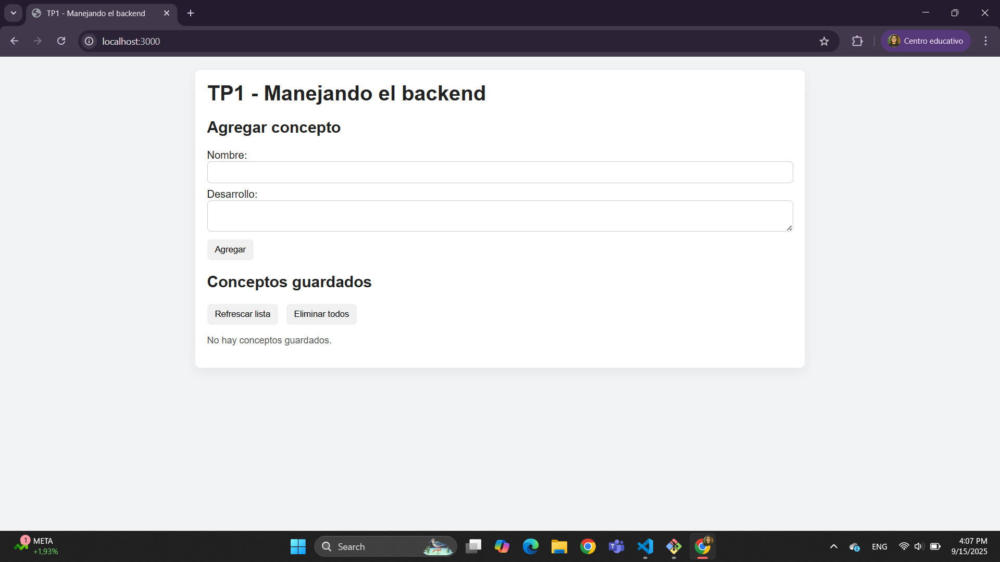

3. Agregar concepto

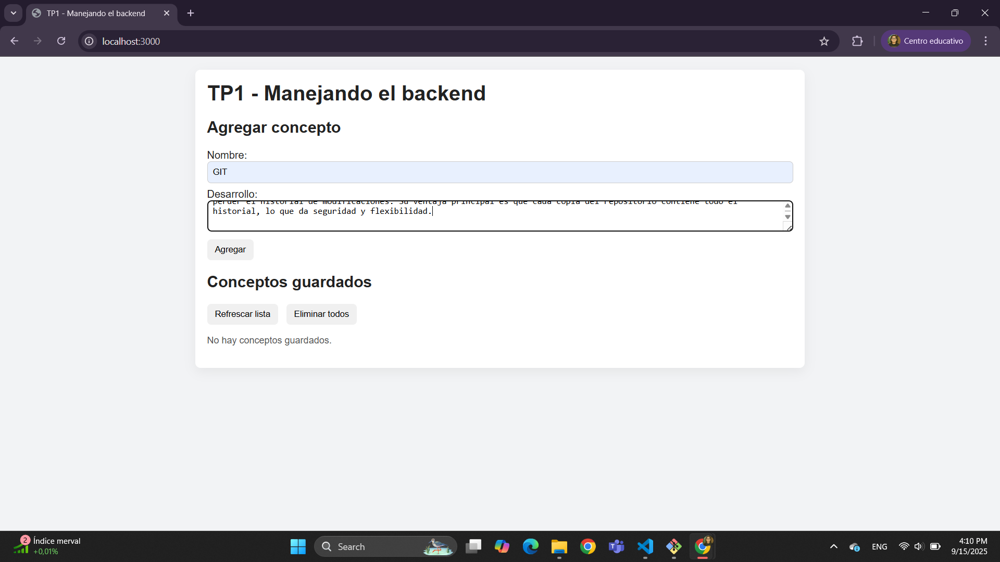

4. Concepto ya guardado

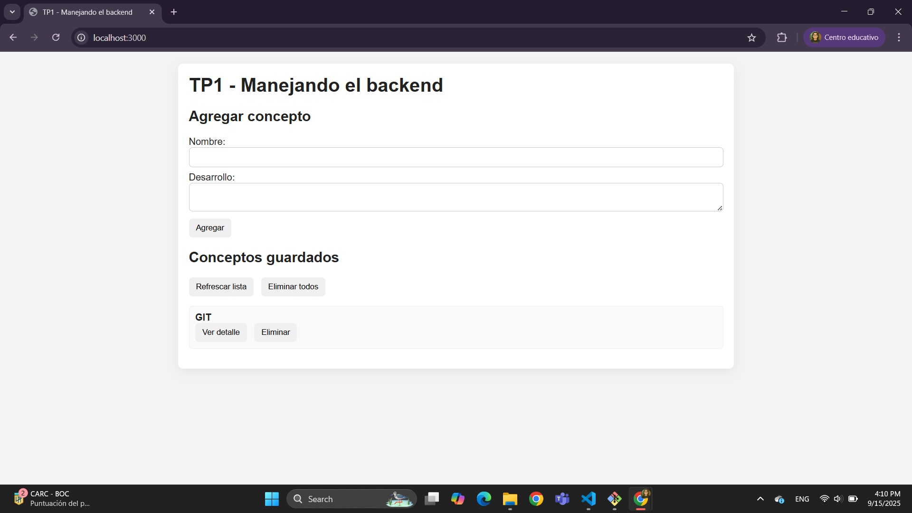

5. Ver detalle del concepto (usa el requerimiento de obtener detalle por ID o GET/ID)

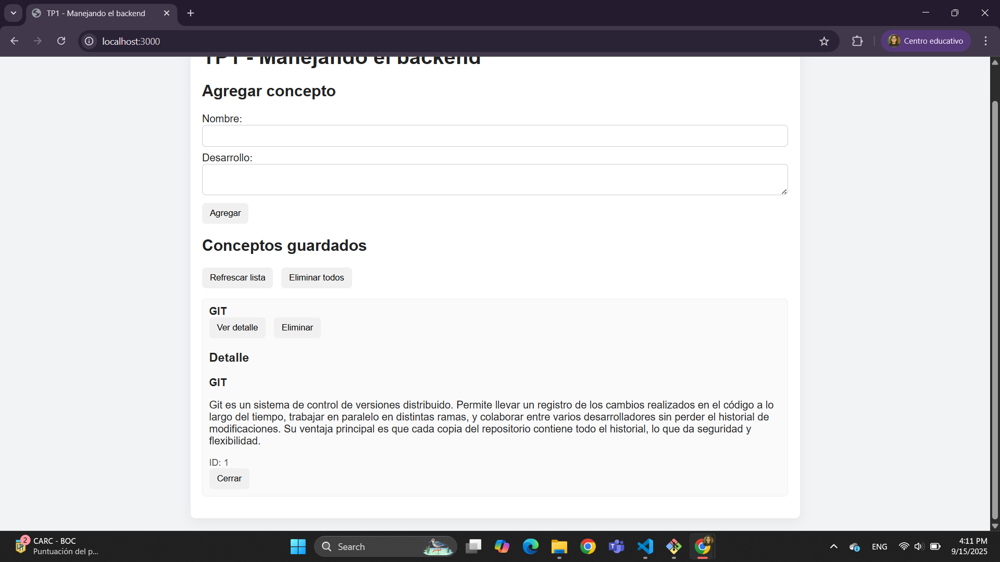

6. Agregar multiples conceptos (la vista principal tiene el listado de conceptos usando GET conceptos)

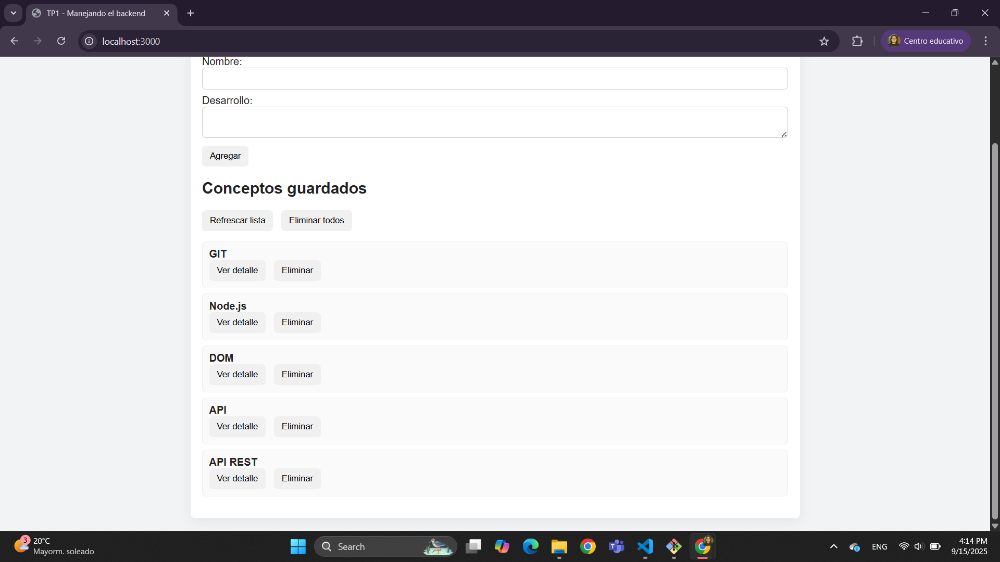

7. Ver detalle de cualquier concepto (usando nuevamente obtener detalle por ID o GET/ID) y tambien cerrar el detalle (se elimina la vista o div)

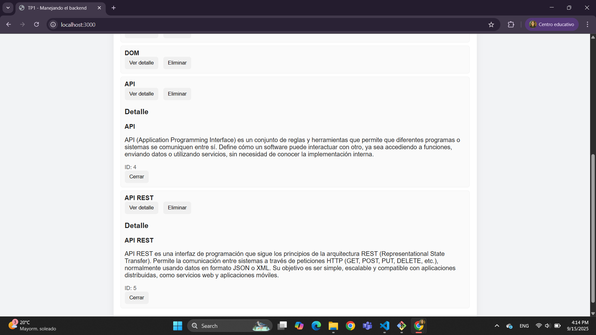

8. Eliminar concepto con boton 'Eliminar' que se encuentra en cada uno (eliminar por ID o DELETE/ID) en este caso se elimino el concepto GIT

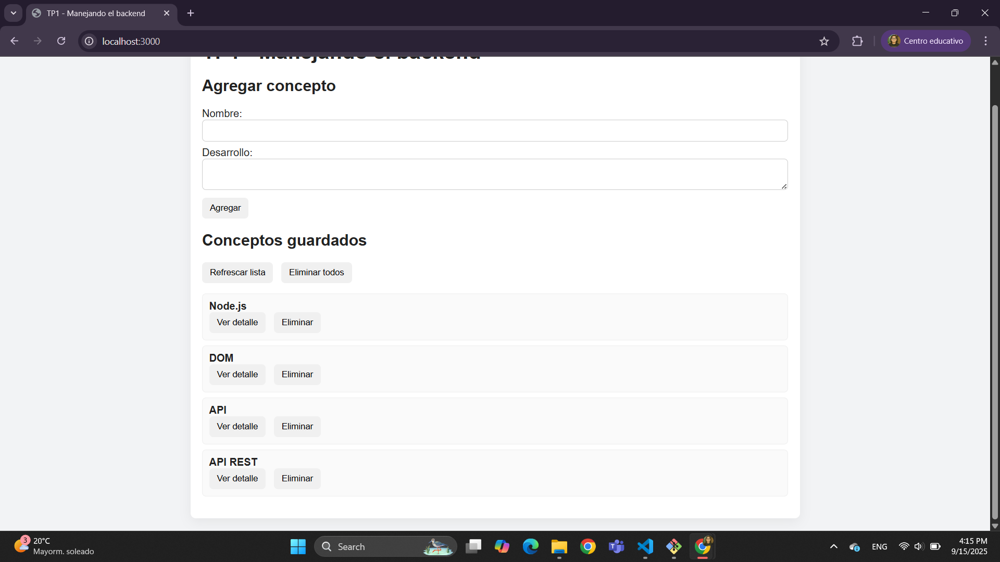

9. Eliminar todos los conceptos con boton 'Eliminar todos' usando DELETE conceptos

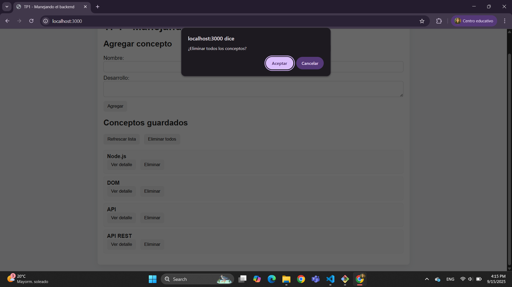

10. Por ultimo incluyo una prueba de las rutas API REST, las cuales permiten obtener el JSON ya se de todos los conceptos o de uno solo (por ID)

Las rutas para comprobar son: 

Para obtener todos los conceptos: http://localhost:3000/api/concepts

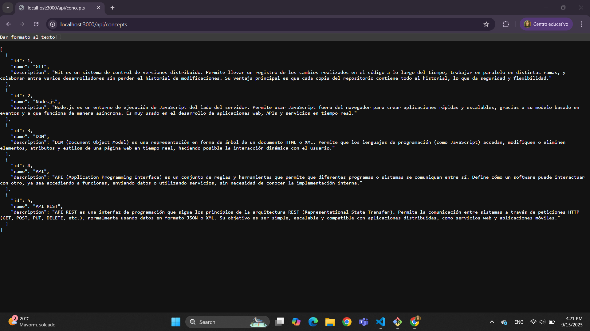

Para obtener un concepto solo (por ID): http://localhost:3000/api/concepts/:id <-- Numero del id, en la imagen es 4

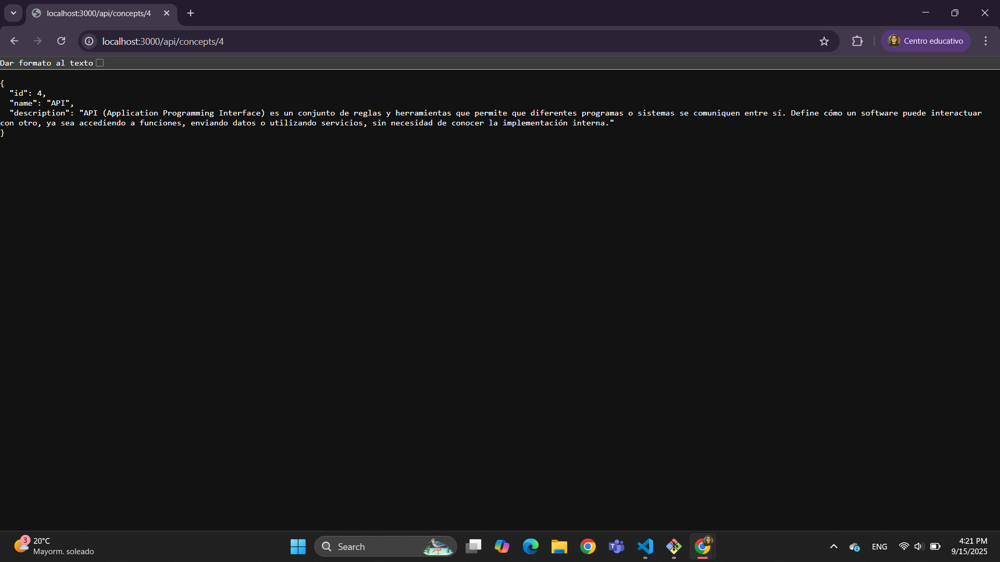

En el caso de POST y DELETE, estan implementados en la vista

Ejemplo:

Vista: boton 'Eliminar' -> dispara fetch DELETE.

Backend (API REST): recibe el DELETE en /concepts/:id y borra.

Frontend: refresca la lista para que ya no aparezca ese concepto.

## Conclusiones

## 5. Conclusiones

Durante el desarrollo de este trabajo práctico aprendí a manejar un flujo de trabajo con Git y GitHub utilizando ramas (`test` y `main`), lo que me permitio comprender la importacia de separar el desarrollo de la produccion, ya que tuve varios errores que de ser subidos a produccion serian serios. También reforcé conceptos de API REST, entendiendo cómo se implementan métodos como `GET`, `POST`, `PUT` y `DELETE` en un servidor con Node.js.

Una de las principales dificultades que encontré fue la gestión del GIT, al principio me equivoque y hice git init y git clone, por lo que se me duplicaron algunas carpetas, luego pude resolverlo pero tuve otros errores que se arrastraron como errores por historiales diferentes y tambien al momento de hacer el primer merge no sabia que podia nombrarlos como los commits, y lo deje como viene, me gustaria haberlo llamado "Primer merge a produccion" o algo parecido. 
Otra dificultad fue probar y comprender cómo funcionan los distintos metodos de la API al principio no entendia bien lo de las rutas y el fetch pero con los PDF + busquedas en internet lo resolvi y comprendi.

En conclusion, este proyecto me permitió obtener la práctica de programación en backend, lo cual hasta ahora no lo habiamos implementado, siempre pense que me gustaria mas el front pero ahora que puse esto en practica me esta gustando. Tambien aprendi a incorporar buenas practicas de control de versiones y documentacion.
